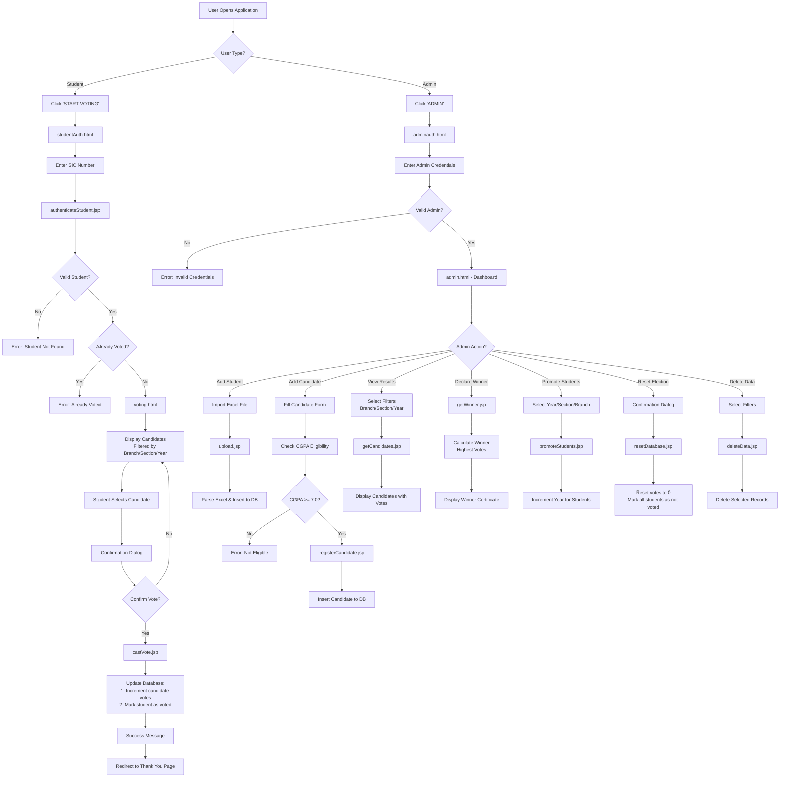

<div align="center">

# ◆ CR ELECTION SYSTEM ◆

### **DIGITAL DEMOCRACY PROTOCOL**


**[📦 GitHub Repository](https://github.com/ELECT-THE-BEST/CR_ELECTION)** | **[📖 Documentation](#-table-of-contents)** | **[🚀 Quick Start](#-quick-start-summary)**

---

### **> SYSTEM INITIALIZED**

*A cutting-edge web-based Class Representative election platform designed to revolutionize the democratic process in educational institutions.*

---

### **👥 DEVELOPMENT TEAM**

| Role | Name | Contribution | Links |
|------|------|--------------|-------|
| **Lead Developer & Functionality** | Tarnala Sribatsa Patro | Complete system functionality, backend logic, database integration | [Portfolio](https://sribatsa.vercel.app) |
| **UI/UX Designer** | Abhijeet Dash | Major UI design (index.html, studentAuth, adminAuth, admin, voting pages) | [GitHub](https://github.com/Abhijeet-Dashy) |
| **CGPA Integration** | Subhasish Praharaj | Base structure for ERP CGPA extraction (app.py) | [GitHub](https://github.com/subhasish52) |
| **Problem Statement, UI & Deployment** | Swastik Bhardwaj | Problem statement, UI development help, Final project deployment | [GitHub](https://github.com/swastik7781) |

</div>

---

## 📋 TABLE OF CONTENTS

- [Problem Statement](#-problem-statement)
- [Solution Overview](#-solution-overview)
- [Screenshots](#-screenshots)
- [Technology Stack](#-technology-stack)
- [File Structure](#-file-structure)
- [System Architecture](#-system-architecture)
- [Installation Guide](#-installation-guide)
- [Apache Tomcat Setup](#-apache-tomcat-setup)
- [Flask Application Setup](#-flask-application-setup)
- [Database Configuration](#-database-configuration)
- [Running the Application](#-running-the-application)
- [System Workflow](#-system-workflow)
- [Features](#-features)
- [Troubleshooting](#-troubleshooting)
- [Credits & Contributors](#-credits--contributors)

---

## 🎯 PROBLEM STATEMENT

### **Traditional Paper-Based Voting System Issues:**

Traditional paper-based voting systems in educational institutions suffer from multiple critical flaws:

#### **1. Privacy Concerns**
- ❌ **Lack of Anonymity**: In paper voting, one person can observe another's vote, compromising voter privacy
- ❌ **Peer Pressure**: Students may feel pressured to vote in a certain way when voting is not truly anonymous
- ❌ **Vote Visibility**: Physical ballots can be seen by others during the voting process

#### **2. Handwriting & Readability Issues**
- ❌ **Illegible Writing**: Difficulty in reading handwritten votes leads to confusion
- ❌ **Misinterpretation**: Unclear handwriting can result in votes being counted incorrectly
- ❌ **Time-Consuming**: Manual reading of each ballot is slow and inefficient

#### **3. Counting Errors**
- ❌ **Human Error**: Manual counting is prone to mistakes and miscalculations
- ❌ **Inconsistency**: Different counters may interpret ballots differently
- ❌ **No Audit Trail**: Difficult to verify the accuracy of counts after the fact

#### **4. Bias & Partiality Concerns**
- ❌ **Perceived Unfairness**: Students may suspect partiality in the counting team
- ❌ **Lack of Transparency**: The counting process is not visible to all stakeholders
- ❌ **Trust Issues**: Difficulty in establishing trust in the electoral process

#### **5. Logistical Challenges**
- ❌ **Resource Intensive**: Requires significant paper, printing, and human resources
- ❌ **Time-Consuming**: Entire process from voting to result declaration takes hours
- ❌ **Storage Issues**: Physical ballots need to be stored securely
- ❌ **Environmental Impact**: Wastage of paper and resources

#### **6. Accessibility & Participation**
- ❌ **Limited Voting Windows**: Students must be present at specific times
- ❌ **Low Turnout**: Physical voting often results in lower participation rates
- ❌ **No Remote Voting**: Students who are absent cannot participate

---

## 💡 SOLUTION OVERVIEW

### **CR Election System: Digital Democracy Protocol**

Our **CR Election System** addresses all the above problems with a modern, secure, and efficient digital voting platform:

#### **✅ Complete Privacy & Anonymity**
- Votes are cast digitally with complete anonymity
- No one can see who voted for whom
- Secure authentication ensures one vote per student

#### **✅ Error-Free Counting**
- Automated vote counting eliminates human errors
- Real-time vote tallying with 100% accuracy
- Instant result generation upon voting closure

#### **✅ Transparency & Trust**
- Real-time analytics visible to administrators
- Audit trails for complete transparency
- Tamper-proof database ensures vote integrity

#### **✅ Enhanced Accessibility**
- Vote from anywhere with internet access
- Extended voting windows for better participation
- Mobile-friendly interface for convenience

#### **✅ Efficiency & Speed**
- Results available instantly after voting ends
- No manual counting required
- Automated certificate generation for winners

#### **✅ Advanced Features**
- CGPA-based eligibility verification
- Candidate profile management with photos and manifestos
- Section-wise, branch-wise, and year-wise filtering
- Student promotion system for year-end transitions
- Data import via Excel for bulk student registration

---

## � SCREENSHOTS

### **Application Interface Walkthrough**

#### **1. Landing Page (index.html)**


The landing page features a futuristic design with:
- **Hero Section**: Bold typography with "SEE WHAT'S HAPPENING" and "DECIDE WHAT HAPPENS NEXT"
- **Navigation Bar**: Quick access to System, Analytics, and Admin sections
- **Stats Display**: Real-time metrics showing Total Students, Candidates, Sections, and Participation %
- **Feature Cards**: Six core features with modern clipped-corner design
- **CTA Buttons**: Prominent "START VOTING" button for students

---

#### **2. Student Authentication (studentAuth.html)**


Clean authentication interface featuring:
- **SIC Input Field**: Students enter their unique Student Identification Code
- **Validation**: Real-time validation ensures correct format
- **Error Handling**: Clear messages for invalid SIC or already voted students
- **Secure Access**: One-time authentication per student

---

#### **3. Admin Authentication (adminauth.html)**
![Admin Auth Page]
Secure admin login portal with:
- **Username & Password Fields**: Protected admin access
- **Authentication Protocol**: Secure credential verification
- **Access Control**: Prevents unauthorized access to admin dashboard
- **Modern Design**: Consistent with overall system aesthetic

---

#### **4. Admin Dashboard (admin.html)**


Comprehensive management interface featuring:
- **Action Buttons**: IMPORT EXCEL, ADD CANDIDATE, VIEW RESULTS, PROMOTE, RESET, DELETE DATA
- **Candidate Grid**: Visual display of all candidates with photos and vote counts
- **Filter System**: Dropdown filters for Branch, Section, and Year
- **Statistics Panel**: Real-time election metrics
- **Data Management**: Bulk operations for student and candidate data

**Key Features:**
- **Import Excel**: Bulk student data import from Excel files
- **Add Candidate**: Register new candidates with CGPA verification
- **View Results**: Real-time vote counting and analytics
- **Promote Students**: Year-end student promotion system
- **Reset Election**: Clear all votes for new election cycle
- **Delete Data**: Selective data deletion with filters

---

#### **5. Voting Interface (voting.html)**


Student voting portal with:
- **Student Info Panel**: Displays logged-in student's details (Name, SIC, Section)
- **Candidate Cards**: Filtered list showing only eligible candidates
- **Candidate Profiles**: Photos, names, SIC numbers, and manifestos
- **Cast Vote Button**: One-click voting with confirmation dialog
- **Logout Option**: Secure session termination
- **Responsive Design**: Works seamlessly on all devices

**Voting Process:**
1. Student authenticates with SIC
2. Views candidates from their section/branch/year
3. Reads candidate manifestos
4. Clicks "CAST VOTE" on preferred candidate
5. Confirms vote in popup dialog
6. Vote is recorded and student is marked as voted

---

#### **6. Winner Certificate (Results Display)**


Professional results display featuring:
- **Winner Announcement**: Prominent display of election winner
- **Candidate Photo**: Winner's profile picture in decorative frame
- **Vote Count**: Total votes received by the winner
- **Certificate Design**: Elegant, professional certificate layout
- **Section Details**: Winner's section, branch, and year information
- **Congratulatory Message**: Formal acknowledgment of victory

---

## �🛠️ TECHNOLOGY STACK

### **Frontend Technologies**
| Technology | Purpose |
|------------|---------|
| **HTML5** | Structure and semantic markup |
| **CSS3** | Styling with advanced animations and glassmorphism |
| **JavaScript (ES6+)** | Client-side logic and interactivity |
| **Rajdhani & Orbitron Fonts** | Modern, futuristic typography |

### **Backend Technologies**
| Technology | Purpose |
|------------|---------|
| **JSP (JavaServer Pages)** | Server-side rendering and business logic |
| **Apache Tomcat 9.0+** | Web server and servlet container |
| **Flask (Python)** | CGPA verification microservice |
| **Selenium WebDriver** | Automated ERP data extraction |

### **Database**
| Technology | Purpose |
|------------|---------|
| **MySQL 8.0+** | Relational database for data persistence |
| **JDBC** | Database connectivity from JSP |

### **Libraries & Dependencies**
| Library | Purpose |
|------------|---------|
| **Apache POI** | Excel file parsing for student import |
| **JSON-Java** | JSON data handling |
| **PDFPlumber** | PDF parsing for CGPA extraction |
| **WebDriver Manager** | Automatic ChromeDriver management |
| **python-dotenv** | Environment variable management |

---

## 📁 FILE STRUCTURE

```
CR_Election/
│
├── 📄 index.html                          # Landing page with system overview
├── 📄 studentAuth.html                    # Student authentication page
├── 📄 voting.html                         # Voting interface for students
├── 📄 adminauth.html                      # Admin authentication page
├── 📄 admin.html                          # Admin dashboard and management
├── 📄 flowchart.html                      # System flowchart visualization
├── 📄 updated_flowchart.html              # Updated flowchart with new features
│
├── 📜 script.js                           # Main JavaScript file (client-side logic)
├── 📜 style.css                           # Global styles (if separate)
│
├── 🔧 JSP Files (Backend Logic)
│   ├── authenticateStudent.jsp           # Student SIC authentication
│   ├── castVote.jsp                      # Vote submission handler
│   ├── registerCandidate.jsp             # Candidate registration
│   ├── getCandidates.jsp                 # Fetch candidates (filtered)
│   ├── getStats.jsp                      # Fetch election statistics
│   ├── getWinner.jsp                     # Determine and fetch winner
│   ├── getStudentBySic.jsp               # Fetch student details by SIC
│   ├── getStudentData.jsp                # Fetch student data
│   ├── deleteCandidate.jsp               # Delete candidate
│   ├── deleteData.jsp                    # Delete student/candidate data
│   ├── promoteStudents.jsp               # Promote students to next year
│   ├── resetDatabase.jsp                 # Reset election data
│   ├── upload.jsp                        # Excel file upload handler
│   ├── updateCandidateMotivation.jsp     # Update candidate manifesto
│   ├── getCGPA.jsp                       # CGPA verification endpoint
│   ├── testFetch.jsp                     # Test endpoint
│   ├── testGetWinner.jsp                 # Test winner calculation
│   └── testStats.html                    # Test statistics display
│
├── 🗄️ Database Scripts
│   ├── setup.sql                         # Initial database setup
│   ├── full_database_setup.sql           # Complete database schema
│   ├── add_candidates_table.sql          # Candidates table creation
│   └── update_tables_for_election.sql    # Table updates
│
├── 📂 WEB-INF/
│   ├── web.xml                           # Web application configuration
│   └── lib/                              # JAR dependencies
│       ├── mysql-connector-java-8.0.x.jar
│       ├── poi-5.2.3.jar
│       ├── poi-ooxml-5.2.3.jar
│       ├── commons-collections4-4.4.jar
│       ├── commons-compress-1.21.jar
│       ├── xmlbeans-5.1.1.jar
│       ├── log4j-api-2.x.x.jar
│       ├── json-20230227.jar
│       └── ... (other dependencies)
│
├── 📂 Download or View CGPA/
│   ├── app.py                            # Flask application for CGPA verification
│   ├── templates/
│   │   └── index.html                    # Flask frontend
│   ├── downloads/                        # PDF download directory
│   ├── .env                              # Environment variables (ERP credentials)
│   └── requirements.txt                  # Python dependencies
│
├── 📂 Documentation
│   ├── README.md                         # This file
│   ├── COMPLETE_SYSTEM_FLOWCHART.md      # Detailed system flowchart
│   ├── FLOWCHART_DOCUMENTATION.md        # Flowchart documentation
│   ├── CGPA_INTEGRATION_GUIDE.md         # CGPA feature guide
│   ├── DELETE_DATA_FEATURE_DOCUMENTATION.md
│   ├── RESULTS_FEATURE_DOCUMENTATION.md
│   └── ... (other documentation files)
│
└── 📂 Assets
    └── flowchart.png                     # System flowchart image
```

---

## 🏗️ SYSTEM ARCHITECTURE

### **Three-Tier Architecture**

```
┌─────────────────────────────────────────────────────────────┐
│                     PRESENTATION LAYER                      │
│  (HTML + CSS + JavaScript - Client-Side Interface)          │
│                                                             │
│  • index.html          • studentAuth.html                   │
│  • voting.html         • admin.html                         │
│  • adminauth.html      • script.js                          │
└──────────────────────────┬──────────────────────────────────┘
                           │
                           ▼
┌─────────────────────────────────────────────────────────────┐
│                     APPLICATION LAYER                       │
│        (JSP - Server-Side Logic & Business Rules)           │
│                                                             │
│  • authenticateStudent.jsp    • castVote.jsp                │
│  • getCandidates.jsp          • getStats.jsp                │
│  • registerCandidate.jsp      • getWinner.jsp               │
│  • promoteStudents.jsp        • upload.jsp                  │
│                                                             │
│  + Flask Microservice (app.py) for CGPA Verification        │
└──────────────────────────┬──────────────────────────────────┘
                           │
                           ▼
┌─────────────────────────────────────────────────────────────┐
│                       DATA LAYER                            │
│              (MySQL Database - Data Persistence)            │
│                                                             │
│  Database: cr_election_db                                   │
│  Tables:                                                    │
│    • students (SIC, name, branch, section, year, voted)     │
│    • candidates (SIC, name, votes, image_url, motivation)   │
└─────────────────────────────────────────────────────────────┘
```

---

## 🚀 INSTALLATION GUIDE

### **Prerequisites**

Before you begin, ensure you have the following installed:

| Software | Version | Download Link |
|----------|---------|---------------|
| **Java JDK** | 8 or higher | [Download](https://www.oracle.com/java/technologies/downloads/) |
| **Apache Tomcat** | 9.0 or higher | [Download](https://tomcat.apache.org/download-90.cgi) |
| **MySQL Server** | 8.0 or higher | [Download](https://dev.mysql.com/downloads/mysql/) |
| **Python** | 3.8 or higher | [Download](https://www.python.org/downloads/) |
| **Google Chrome** | Latest | [Download](https://www.google.com/chrome/) |
| **Git** | Latest | [Download](https://git-scm.com/downloads) |

---

### **Step 1: Clone the Repository**

Open your terminal or command prompt and run:

```bash
# Clone the repository
git clone https://github.com/Abhijeet-Dashy/CR_Election.git

# Navigate to the project directory
cd CR_Election
```

**Alternative:** Download the ZIP file from GitHub and extract it to your desired location.

---

### **Step 2: Verify Java Installation**

```bash
# Check Java version
java -version

# Check Java compiler version
javac -version
```

**Expected Output:**
```
java version "1.8.0_xxx" or higher
javac 1.8.0_xxx or higher
```

If not installed, download and install JDK from the link above.

---

## 🔧 APACHE TOMCAT SETUP

### **Step 1: Download and Install Apache Tomcat**

1. **Download Tomcat 9.0** from [Apache Tomcat Downloads](https://tomcat.apache.org/download-90.cgi)
   - For Windows: Download the **32-bit/64-bit Windows Service Installer (.exe)**
   - For Linux/Mac: Download the **Core tar.gz**

2. **Install Tomcat:**
   - **Windows:** Run the installer and follow the setup wizard
     - Default installation path: `C:\Program Files\Apache Software Foundation\Tomcat 9.0`
   - **Linux/Mac:** Extract the tar.gz file to your preferred location

3. **Set Installation Path:**
   - Remember your Tomcat installation directory (we'll call this `TOMCAT_HOME`)
   - Example: `C:\Program Files\Apache Software Foundation\Tomcat 9.0`

---

### **Step 2: Configure Environment Variables**

#### **Windows:**

1. **Set CATALINA_HOME:**
   - Right-click **This PC** → **Properties** → **Advanced system settings**
   - Click **Environment Variables**
   - Under **System Variables**, click **New**
   - Variable name: `CATALINA_HOME`
   - Variable value: `C:\Program Files\Apache Software Foundation\Tomcat 9.0`
   - Click **OK**

2. **Add to PATH:**
   - In **System Variables**, find **Path** and click **Edit**
   - Click **New** and add: `%CATALINA_HOME%\bin`
   - Click **OK**

#### **Linux/Mac:**

```bash
# Add to ~/.bashrc or ~/.zshrc
export CATALINA_HOME=/path/to/tomcat
export PATH=$CATALINA_HOME/bin:$PATH

# Reload the configuration
source ~/.bashrc  # or source ~/.zshrc
```

---

### **Step 3: Deploy the Application to Tomcat**

#### **Method 1: Copy to webapps (Recommended)**

1. **Navigate to your project directory:**
   ```bash
   cd C:\Users\tsrib\OneDrive\Desktop\CR_Election
   ```

2. **Copy all project files to Tomcat's webapps directory:**
   ```bash
   # Windows (Command Prompt)
   xcopy /E /I /Y "C:\Users\tsrib\OneDrive\Desktop\CR_Election" "C:\Program Files\Apache Software Foundation\Tomcat 9.0\webapps\CR_Election"

   # Windows (PowerShell)
   Copy-Item -Path "C:\Users\tsrib\OneDrive\Desktop\CR_Election\*" -Destination "C:\Program Files\Apache Software Foundation\Tomcat 9.0\webapps\CR_Election" -Recurse -Force

   # Linux/Mac
   cp -r /path/to/CR_Election /path/to/tomcat/webapps/
   ```

3. **Verify the structure:**
   ```
   TOMCAT_HOME/webapps/CR_Election/
   ├── index.html
   ├── studentAuth.html
   ├── voting.html
   ├── admin.html
   ├── *.jsp files
   └── WEB-INF/
       ├── web.xml
       └── lib/
           └── *.jar files
   ```

#### **Method 2: Create a WAR file (Advanced)**

```bash
# Navigate to project directory
cd C:\Users\tsrib\OneDrive\Desktop\CR_Election

# Create WAR file
jar -cvf CR_Election.war *

# Copy WAR to Tomcat webapps
copy CR_Election.war "C:\Program Files\Apache Software Foundation\Tomcat 9.0\webapps\"
```

---

### **Step 4: Add Required JAR Files**

Copy all required JAR files to `TOMCAT_HOME/webapps/CR_Election/WEB-INF/lib/`:

**Required JARs:**
- `mysql-connector-java-8.0.x.jar` (MySQL JDBC Driver)
- `poi-5.2.3.jar` (Apache POI - Excel handling)
- `poi-ooxml-5.2.3.jar` (Apache POI OOXML)
- `commons-collections4-4.4.jar`
- `commons-compress-1.21.jar`
- `xmlbeans-5.1.1.jar`
- `log4j-api-2.x.x.jar`
- `json-20230227.jar` (JSON handling)

**Download locations:**
- MySQL Connector: [Maven Repository](https://mvnrepository.com/artifact/mysql/mysql-connector-java)
- Apache POI: [Apache POI Downloads](https://poi.apache.org/download.html)
- JSON: [Maven Repository](https://mvnrepository.com/artifact/org.json/json)

---

### **Step 5: Configure Tomcat as a Windows Service**

#### **Option 1: Using the Installer (Recommended)**

If you used the Windows Service Installer, Tomcat is already configured as a service.

#### **Option 2: Manual Service Configuration**

1. **Open Command Prompt as Administrator**

2. **Navigate to Tomcat bin directory:**
   ```cmd
   cd "C:\Program Files\Apache Software Foundation\Tomcat 9.0\bin"
   ```

3. **Install the service:**
   ```cmd
   service.bat install
   ```

4. **Verify service installation:**
   ```cmd
   # Open Services Manager
   services.msc
   ```
   - Look for **Apache Tomcat 9.0 Tomcat9** in the list

---

### **Step 6: Start Tomcat Server**

#### **Method 1: Using Services (Windows)**

1. **Open Services Manager:**
   ```cmd
   services.msc
   ```

2. **Find "Apache Tomcat 9.0 Tomcat9"**

3. **Right-click → Start**

4. **Set to Automatic (Optional):**
   - Right-click → **Properties**
   - Startup type: **Automatic**
   - Click **Apply** → **OK**

#### **Method 2: Using Command Line**

```cmd
# Windows
cd "C:\Program Files\Apache Software Foundation\Tomcat 9.0\bin"
startup.bat

# Linux/Mac
cd /path/to/tomcat/bin
./startup.sh
```

#### **Method 3: Using Tomcat Monitor (Windows)**

- Look for the Tomcat icon in the system tray
- Right-click → **Start service**

---

### **Step 7: Verify Tomcat is Running**

1. **Open your web browser**

2. **Navigate to:**
   ```
   http://localhost:8080
   ```

3. **You should see the Tomcat welcome page**

4. **Access your application:**
   ```
   http://localhost:8080/CR_Election/index.html
   ```

---

## 🗄️ DATABASE CONFIGURATION

### **Step 1: Install MySQL**

1. **Download MySQL Installer** from [MySQL Downloads](https://dev.mysql.com/downloads/installer/)

2. **Run the installer** and select:
   - MySQL Server
   - MySQL Workbench (optional, but recommended)

3. **During installation:**
   - Set root password (remember this!)
   - Default port: **3306**
   - Authentication: **Use Strong Password Encryption**

---

### **Step 2: Create Database and Tables**

#### **Option 1: Using MySQL Workbench (GUI)**

1. **Open MySQL Workbench**

2. **Connect to your MySQL server:**
   - Click on your local instance
   - Enter root password

3. **Create the database:**
   - Click **Create a new schema** (database icon)
   - Schema name: `cr_election_db`
   - Click **Apply**

4. **Run the setup script:**
   - Open `full_database_setup.sql` from the project
   - Click **Execute** (lightning bolt icon)

#### **Option 2: Using Command Line**

```bash
# Login to MySQL
mysql -u root -p

# Enter your password when prompted

# Create database
CREATE DATABASE cr_election_db;

# Use the database
USE cr_election_db;

# Run the setup script
source C:/Users/tsrib/OneDrive/Desktop/CR_Election/full_database_setup.sql;

# Verify tables were created
SHOW TABLES;

# Exit MySQL
exit;
```

---

### **Step 3: Database Schema**

The system uses two main tables:

#### **1. Students Table**

```sql
CREATE TABLE students (
    id INT NOT NULL AUTO_INCREMENT PRIMARY KEY,
    serial_no VARCHAR(50) NOT NULL,
    roll_no VARCHAR(50) NOT NULL,
    sic VARCHAR(50) NOT NULL,
    reg_code VARCHAR(50),
    image_url VARCHAR(255),
    name VARCHAR(100),
    branch VARCHAR(100),
    section VARCHAR(50),
    year INT,
    isVoted TINYINT(1) NOT NULL DEFAULT 0,
    INDEX idx_sic (sic)
);
```

**Columns:**
- `id`: Auto-increment primary key
- `serial_no`: Serial number from Excel import
- `roll_no`: Student's roll number
- `sic`: Student Identification Code (Unique identifier)
- `reg_code`: Registration code
- `image_url`: URL/path to student's photo
- `name`: Student's full name
- `branch`: Academic branch (e.g., CSE, ECE, MECH, CIVIL)
- `section`: Section (e.g., A, B, C, D)
- `year`: Current academic year (1, 2, 3, 4)
- `isVoted`: Boolean flag (0 = not voted, 1 = voted)

#### **2. Candidates Table**

```sql
CREATE TABLE candidates (
    id INT NOT NULL AUTO_INCREMENT PRIMARY KEY,
    sic VARCHAR(50) NOT NULL UNIQUE,
    votes INT DEFAULT 0,
    motiv TEXT,
    created_at TIMESTAMP DEFAULT CURRENT_TIMESTAMP,
    updated_at TIMESTAMP DEFAULT CURRENT_TIMESTAMP ON UPDATE CURRENT_TIMESTAMP
);
```

**Columns:**
- `id`: Auto-increment primary key
- `sic`: Candidate's SIC (Unique, references student's SIC)
- `votes`: Number of votes received (default 0)
- `motiv`: Candidate's motivation/manifesto statement
- `created_at`: Timestamp of candidate registration
- `updated_at`: Timestamp of last update

**Note:** Candidate details (name, branch, section, year, image_url) are fetched from the `students` table using the `sic` as the common key.

---

### **Step 4: Update Database Credentials in JSP Files**

All JSP files that connect to the database need to be updated with your MySQL credentials.

**Files to update:**
- `authenticateStudent.jsp`
- `castVote.jsp`
- `getCandidates.jsp`
- `getStats.jsp`
- `registerCandidate.jsp`
- `getWinner.jsp`
- `upload.jsp`
- And all other JSP files with database connections

**Find this section in each JSP file:**

```java
String url = "jdbc:mysql://localhost:3306/cr_election_db";
String user = "root";
String password = "your_password_here";  // ← UPDATE THIS
```

**Replace with your MySQL credentials:**

```java
String url = "jdbc:mysql://localhost:3306/cr_election_db";
String user = "root";
String password = "YourActualMySQLPassword";  // Your MySQL root password
```

---

## 🐍 FLASK APPLICATION SETUP

The Flask application handles CGPA verification by logging into the ERP system and extracting CGPA from student result PDFs.

### **Step 1: Navigate to Flask Directory**

```bash
cd "C:\Users\tsrib\OneDrive\Desktop\CR_Election\Download or View CGPA"
```

---

### **Step 2: Install Python Dependencies**

```bash
# Create a virtual environment (recommended)
python -m venv venv

# Activate virtual environment
# Windows:
venv\Scripts\activate
# Linux/Mac:
source venv/bin/activate

# Install dependencies
pip install flask selenium webdriver-manager python-dotenv pdfplumber
```

**Or use requirements.txt if available:**

```bash
pip install -r requirements.txt
```

---

### **Step 3: Configure Environment Variables**

1. **Create a `.env` file** in the `Download or View CGPA` directory:

```bash
# Create .env file
notepad .env  # Windows
nano .env     # Linux/Mac
```

2. **Add your ERP credentials:**

```env
ERP_USERNAME=your_erp_username
ERP_PASSWORD=your_erp_password
```

**Example:**
```env
ERP_USERNAME=SITBBS12345678
ERP_PASSWORD=MySecurePassword123
```

⚠️ **Important:** Never commit the `.env` file to version control!

---

### **Step 4: Install ChromeDriver**

The application uses Selenium WebDriver, which requires ChromeDriver.

**Automatic Installation (Recommended):**
- The application uses `webdriver-manager` which automatically downloads and manages ChromeDriver
- No manual installation needed!

**Manual Installation (if needed):**
1. Download ChromeDriver from [ChromeDriver Downloads](https://chromedriver.chromium.org/downloads)
2. Match the version with your installed Chrome browser
3. Add to system PATH

---

### **Step 5: Test Flask Application**

```bash
# Make sure you're in the Flask directory
cd "C:\Users\tsrib\OneDrive\Desktop\CR_Election\Download or View CGPA"

# Run the Flask app
python app.py
```

**Expected Output:**
```
[INFO] Credentials loaded - Username: SITBBS12345678
 * Serving Flask app 'app'
 * Debug mode: on
 * Running on http://0.0.0.0:5000
```

**Access the Flask app:**
```
http://localhost:5000
```

---

## ▶️ RUNNING THE APPLICATION

### **Complete Startup Sequence**

Follow these steps in order to run the complete CR Election System:

---

### **Step 1: Start MySQL Server**

#### **Windows:**

```cmd
# Open Services
services.msc

# Find "MySQL80" (or your MySQL version)
# Right-click → Start
```

**Or use Command Line:**
```cmd
net start MySQL80
```

#### **Linux/Mac:**

```bash
# Start MySQL service
sudo systemctl start mysql  # Linux
brew services start mysql   # Mac
```

**Verify MySQL is running:**
```bash
mysql -u root -p
# Enter password
# If you can login, MySQL is running
exit;
```

---

### **Step 2: Start Apache Tomcat**

#### **Method 1: Using Services (Windows)**

```cmd
# Open Services Manager
services.msc

# Find "Apache Tomcat 9.0 Tomcat9"
# Right-click → Start
```

#### **Method 2: Using Command Line**

```cmd
# Windows
cd "C:\Program Files\Apache Software Foundation\Tomcat 9.0\bin"
startup.bat

# Linux/Mac
cd /path/to/tomcat/bin
./startup.sh
```

**Verify Tomcat is running:**
- Open browser: `http://localhost:8080`
- You should see the Tomcat welcome page

**Check application deployment:**
- Navigate to: `http://localhost:8080/CR_Election/index.html`
- You should see the CR Election landing page

---

### **Step 3: Start Flask Application (for CGPA Verification)**

```bash
# Open a new terminal/command prompt
cd "C:\Users\tsrib\OneDrive\Desktop\CR_Election\Download or View CGPA"

# Activate virtual environment (if using)
venv\Scripts\activate  # Windows
source venv/bin/activate  # Linux/Mac

# Run Flask app
python app.py
```

**Expected Output:**
```
[INFO] Credentials loaded - Username: SITBBS********
 * Running on http://0.0.0.0:5000
```

**Keep this terminal open** - the Flask app needs to run continuously for CGPA verification to work.

---

### **Step 4: Access the Application**

Open your web browser and navigate to:

```
http://localhost:8080/CR_Election/index.html
```

---

## 🔄 SYSTEM WORKFLOW

### **Complete User Journey Flowchart**



---

### **Detailed Workflow Steps**

#### **1. Student Voting Flow**

```
┌─────────────────────────────────────────────────────────────┐
│ STEP 1: Landing Page (index.html)                           │
├─────────────────────────────────────────────────────────────┤
│ • Student clicks "START VOTING" button                      │
│ • Redirects to studentAuth.html                             │
└─────────────────────────────────────────────────────────────┘
                           ↓
┌─────────────────────────────────────────────────────────────┐
│ STEP 2: Student Authentication (studentAuth.html)           │
├─────────────────────────────────────────────────────────────┤
│ • Student enters their SIC number                           │
│ • Form submits to authenticateStudent.jsp                   │
└─────────────────────────────────────────────────────────────┘
                           ↓
┌─────────────────────────────────────────────────────────────┐
│ STEP 3: Authentication Processing (authenticateStudent.jsp) │
├─────────────────────────────────────────────────────────────┤
│ • Query database for SIC in students table                  │
│ • Check if student exists                                   │
│ • Check if student has already voted                        │
│ • If valid: Redirect to voting.html with student data       │
│ • If invalid: Show error message                            │
└─────────────────────────────────────────────────────────────┘
                           ↓
┌─────────────────────────────────────────────────────────────┐
│ STEP 4: Voting Interface (voting.html)                      │
├─────────────────────────────────────────────────────────────┤
│ • Display student information (name, SIC, section)          │
│ • Fetch candidates via getCandidates.jsp                    │
│ • Filter candidates by student's branch/section/year        │
│ • Display candidate cards with photos and manifestos        │
└─────────────────────────────────────────────────────────────┘
                           ↓
┌─────────────────────────────────────────────────────────────┐
│ STEP 5: Cast Vote (castVote.jsp)                           │
├─────────────────────────────────────────────────────────────┤
│ • Student clicks "Cast Vote" on a candidate                 │
│ • Confirmation dialog appears                               │
│ • If confirmed:                                             │
│   1. Increment candidate's vote count                       │
│   2. Update student's voted status to TRUE                  │
│   3. Record voted_for candidate SIC                         │
│ • Show success message                                      │
└─────────────────────────────────────────────────────────────┘
```

#### **2. Admin Management Flow**

```
┌─────────────────────────────────────────────────────────────┐
│ STEP 1: Admin Authentication (adminauth.html)               │
├─────────────────────────────────────────────────────────────┤
│ • Admin enters credentials                                  │
│ • Hardcoded check (can be enhanced with database)           │
│ • If valid: Redirect to admin.html                          │
└─────────────────────────────────────────────────────────────┘
                           ↓
┌─────────────────────────────────────────────────────────────┐
│ STEP 2: Admin Dashboard (admin.html)                        │
├─────────────────────────────────────────────────────────────┤
│ Available Actions:                                          │
│ • Import Students (Excel)                                   │
│ • Add Candidate                                             │
│ • View Candidates                                           │
│ • View Statistics                                           │
│ • Declare Winner                                            │
│ • Promote Students                                          │
│ • Reset Election                                            │
│ • Delete Data                                               │
└─────────────────────────────────────────────────────────────┘
```

**Import Students:**
```
Excel File → upload.jsp → Parse with Apache POI → Insert into students table
```

**Add Candidate:**
```
Fill Form → Check CGPA (getCGPA.jsp → Flask app.py → ERP) → registerCandidate.jsp → Insert into candidates table
```

**View Results:**
```
Select Filters → getCandidates.jsp → Fetch from candidates table → Display with vote counts
```

**Declare Winner:**
```
getWinner.jsp → Query candidate with MAX(votes) → Display winner certificate
```

**Promote Students:**
```
Select Year/Section/Branch → promoteStudents.jsp → UPDATE students SET year = year + 1
```

**Reset Election:**
```
Confirmation → resetDatabase.jsp → UPDATE candidates SET votes = 0; UPDATE students SET voted = FALSE
```

---

## ✨ FEATURES

### **🔐 Security Features**
- ✅ One-time voting per student (duplicate vote prevention)
- ✅ SIC-based authentication
- ✅ Admin authentication for management access
- ✅ SQL injection prevention through prepared statements
- ✅ Session management for secure access

### **📊 Analytics & Reporting**
- ✅ Real-time vote counting
- ✅ Live statistics (total students, candidates, participation %)
- ✅ Section-wise, branch-wise, year-wise filtering
- ✅ Winner declaration with certificate generation
- ✅ Detailed candidate profiles with vote counts

### **👥 Student Management**
- ✅ Bulk student import via Excel (.xlsx, .xls, .csv)
- ✅ Student promotion system (year-end transition)
- ✅ Student data deletion with filters
- ✅ Automatic eligibility verification

### **🎯 Candidate Management**
- ✅ Candidate registration with photo upload
- ✅ CGPA-based eligibility check (minimum 7.0)
- ✅ Manifesto/motivation statement support
- ✅ Candidate profile editing
- ✅ Candidate deletion

### **🎨 User Interface**
- ✅ Modern, futuristic design with glassmorphism
- ✅ Smooth animations and transitions
- ✅ Responsive layout (mobile-friendly)
- ✅ Interactive candidate cards
- ✅ Real-time data updates
- ✅ Loading states and error handling

### **🔄 Advanced Features**
- ✅ Automated CGPA verification via ERP integration
- ✅ PDF parsing for result extraction
- ✅ Excel file parsing for bulk operations
- ✅ Database reset functionality
- ✅ System flowchart visualization
- ✅ Comprehensive error handling

---

## 🛠️ TROUBLESHOOTING

### **Common Issues and Solutions**

#### **1. Tomcat Not Starting**

**Problem:** Tomcat service fails to start

**Solutions:**
```cmd
# Check if port 8080 is already in use
netstat -ano | findstr :8080

# Kill the process using port 8080
taskkill /PID <process_id> /F

# Or change Tomcat port in server.xml
# Navigate to: TOMCAT_HOME/conf/server.xml
# Find: <Connector port="8080" ...
# Change to: <Connector port="8081" ...
```

---

#### **2. Database Connection Failed**

**Problem:** JSP pages show "Cannot connect to database"

**Solutions:**
1. **Verify MySQL is running:**
   ```cmd
   services.msc
   # Check if MySQL80 is running
   ```

2. **Check credentials in JSP files:**
   ```java
   String password = "your_actual_password";  // Update this
   ```

3. **Test connection manually:**
   ```bash
   mysql -u root -p
   # If this fails, MySQL is not running or password is wrong
   ```

4. **Verify database exists:**
   ```sql
   SHOW DATABASES;
   # Look for cr_election_db
   ```

---

#### **3. JSP Compilation Errors**

**Problem:** `JasperException: Unable to compile class for JSP`

**Solutions:**
1. **Check if all JAR files are in WEB-INF/lib:**
   ```
   TOMCAT_HOME/webapps/CR_Election/WEB-INF/lib/
   ├── mysql-connector-java-8.0.x.jar
   ├── poi-5.2.3.jar
   ├── json-20230227.jar
   └── ... (other JARs)
   ```

2. **Restart Tomcat after adding JARs:**
   ```cmd
   # Stop Tomcat
   shutdown.bat
   # Start Tomcat
   startup.bat
   ```

3. **Check for syntax errors in JSP files**

---

#### **4. Flask App Not Starting**

**Problem:** `ModuleNotFoundError` or `ImportError`

**Solutions:**
```bash
# Reinstall dependencies
pip install --upgrade flask selenium webdriver-manager python-dotenv pdfplumber

# Check Python version
python --version  # Should be 3.8+

# Verify virtual environment is activated
# You should see (venv) in your terminal prompt
```

---

#### **5. CGPA Verification Failing**

**Problem:** CGPA check returns "Failed to download PDF"

**Solutions:**
1. **Check ERP credentials in .env file:**
   ```env
   ERP_USERNAME=SITBBS12345678  # Correct format
   ERP_PASSWORD=YourPassword
   ```

2. **Verify Chrome is installed:**
   ```bash
   # Check Chrome version
   chrome --version  # Linux/Mac
   # Windows: Open Chrome → Settings → About Chrome
   ```

3. **Check internet connection** (ERP access requires internet)

4. **Run Flask in non-headless mode for debugging:**
   ```python
   # In app.py, comment out this line:
   # options.add_argument("--headless")
   ```

---

#### **6. Excel Import Not Working**

**Problem:** "Failed to import Excel file"

**Solutions:**
1. **Verify Excel file format:**
   - Must be `.xlsx`, `.xls`, or `.csv`
   - First row should contain headers: `sic, name, branch, section, year`

2. **Check Apache POI JARs:**
   ```
   WEB-INF/lib/
   ├── poi-5.2.3.jar
   ├── poi-ooxml-5.2.3.jar
   ├── commons-collections4-4.4.jar
   ├── commons-compress-1.21.jar
   └── xmlbeans-5.1.1.jar
   ```

3. **Convert Strict OOXML to regular XLSX:**
   - Open in Excel → Save As → Excel Workbook (.xlsx)

---

#### **7. Application Not Loading (404 Error)**

**Problem:** `http://localhost:8080/CR_Election/index.html` shows 404

**Solutions:**
1. **Verify deployment:**
   ```
   TOMCAT_HOME/webapps/CR_Election/
   └── index.html (should exist)
   ```

2. **Check Tomcat logs:**
   ```
   TOMCAT_HOME/logs/catalina.out  # Linux/Mac
   TOMCAT_HOME/logs/catalina.YYYY-MM-DD.log  # Windows
   ```

3. **Redeploy application:**
   ```cmd
   # Delete old deployment
   rmdir /S "C:\Program Files\Apache Software Foundation\Tomcat 9.0\webapps\CR_Election"
   
   # Copy again
   xcopy /E /I /Y "C:\Users\tsrib\OneDrive\Desktop\CR_Election" "C:\Program Files\Apache Software Foundation\Tomcat 9.0\webapps\CR_Election"
   
   # Restart Tomcat
   ```

---

#### **8. Votes Not Updating**

**Problem:** Vote count doesn't increase after voting

**Solutions:**
1. **Check browser console for errors:**
   - Press F12 → Console tab
   - Look for JavaScript errors

2. **Verify castVote.jsp is working:**
   - Check Tomcat logs for errors
   - Test database connection

3. **Clear browser cache:**
   - Ctrl + Shift + Delete
   - Clear cached images and files

---

#### **9. Images Not Displaying**

**Problem:** Candidate photos not showing

**Solutions:**
1. **Check image URL format:**
   ```javascript
   // Should be relative or absolute path
   image_url: "images/candidate1.jpg"
   // Or
   image_url: "http://localhost:8080/CR_Election/images/candidate1.jpg"
   ```

2. **Verify image files exist in the correct directory**

3. **Check file permissions**

---

### **Getting Help**

If you encounter issues not covered here:

1. **Check Tomcat Logs:**
   ```
   TOMCAT_HOME/logs/catalina.out
   TOMCAT_HOME/logs/localhost.YYYY-MM-DD.log
   ```

2. **Check Browser Console:**
   - Press F12 → Console tab
   - Look for JavaScript errors

3. **Check Database:**
   ```sql
   -- Verify data exists
   SELECT * FROM students LIMIT 10;
   SELECT * FROM candidates LIMIT 10;
   ```

4. **Contact Support:**
   - GitHub Issues: [Create an issue](https://github.com/Abhijeet-Dashy/CR_Election/issues)
   - Email: [Your support email]

---

## 📞 SUPPORT & CONTRIBUTION

### **Contributors**
- **Abhijeet Dashy** - Lead Developer

### **Contributing**
Contributions are welcome! Please follow these steps:

1. Fork the repository
2. Create a feature branch (`git checkout -b feature/AmazingFeature`)
3. Commit your changes (`git commit -m 'Add some AmazingFeature'`)
4. Push to the branch (`git push origin feature/AmazingFeature`)
5. Open a Pull Request

### **License**
This project is licensed under the MIT License - see the LICENSE file for details.

---

## 📊 EXCEL IMPORT FORMAT

### **Student Data Import via Excel**

The admin can import student data in bulk using Excel files (.xlsx, .xls, or .csv). The Excel file must follow this exact format:

#### **Required Column Names (Header Row)**

| Column Name | Data Type | Description | Example |
|-------------|-----------|-------------|---------|
| **Sl No** | Text/Number | Serial number | 1, 2, 3... |
| **Roll No** | Text | Student's roll number | 2201001, 2201002 |
| **SIC No** | Text | Student Identification Code (Unique) | SITBBS12345678 |
| **Regd No** | Text | Registration number | REG2022001 |
| **Photo URL** | Text | URL or path to student's photo | https://example.com/photo.jpg |
| **Student Name** | Text | Full name of the student | John Doe |
| **Branch** | Text | Academic branch | CSE, ECE, MECH, CIVIL |
| **Section** | Text | Section | A, B, C, D |
| **Year** | Number | Current academic year | 1, 2, 3, 4 |

#### **Sample Excel Data**

```
Sl No | Roll No  | SIC No         | Regd No    | Photo URL                        | Student Name      | Branch | Section | Year
------|----------|----------------|------------|----------------------------------|-------------------|--------|---------|-----
1     | 2201001  | SITBBS12345678 | REG2022001 | https://example.com/john.jpg     | John Doe          | CSE    | A       | 2
2     | 2201002  | SITBBS12345679 | REG2022002 | https://example.com/jane.jpg     | Jane Smith        | CSE    | A       | 2
3     | 2201003  | SITBBS12345680 | REG2022003 | https://example.com/mike.jpg     | Mike Johnson      | ECE    | B       | 2
4     | 2201004  | SITBBS12345681 | REG2022004 | https://example.com/sarah.jpg    | Sarah Williams    | MECH   | C       | 3
```

#### **Important Notes:**

1. **Header Row is Mandatory**: The first row must contain the exact column names as shown above
2. **SIC No Must Be Unique**: Each student must have a unique SIC number
3. **No Empty Rows**: Remove any empty rows between data
4. **Consistent Data Types**: Ensure Year is a number, not text
5. **Photo URL**: Can be left empty if no photo is available
6. **File Format**: Supported formats are .xlsx, .xls, and .csv

#### **How to Import:**

1. Navigate to **Admin Dashboard** (admin.html)
2. Click **"IMPORT EXCEL"** button in the navigation bar
3. Select your Excel file from the file explorer
4. System will validate and import the data
5. Success/error messages will be displayed
6. Imported students will appear in the database

#### **Common Import Errors:**

- **"Invalid file format"**: Use .xlsx, .xls, or .csv only
- **"Missing required columns"**: Ensure all column names match exactly
- **"Duplicate SIC"**: Each SIC must be unique in the database
- **"Invalid year value"**: Year must be a number (1-4)

---

## 👨‍💻 CREDITS & CONTRIBUTORS

### **Development Team**

This project was developed by a talented team of developers, each contributing their expertise to create a comprehensive election management system.

---

#### **🔧 Lead Developer & Functionality**
**Tarnala Sribatsa Patro**
- **Role**: Lead Developer, Backend Architecture, Database Design
- **Contributions**:
  - Complete system functionality implementation
  - Backend logic and JSP development
  - Database schema design and integration
  - CGPA verification system integration
  - Student and candidate management features
  - Vote counting and results calculation
  - Excel import/export functionality
  - Student promotion system
  - Data deletion and reset features
  - System testing and debugging
- **Portfolio**: [https://sribatsa.vercel.app](https://sribatsa.vercel.app)
- **Contact**: Available through portfolio

---

#### **🎨 UI/UX Designer**
**Abhijeet Dash**
- **Role**: Frontend Developer, UI/UX Designer
- **Contributions**:
  - Major UI design for all pages:
    - Landing page (index.html) - Futuristic hero section and features
    - Student authentication page (studentAuth.html)
    - Admin authentication page (adminauth.html)
    - Admin dashboard (admin.html) - Complete management interface
    - Voting interface (voting.html) - Student voting portal
  - Modern, cyberpunk-inspired design system
  - Color scheme and typography selection
  - Responsive layouts and animations
  - Glassmorphism effects and visual enhancements
  - User experience optimization
- **GitHub**: [https://github.com/Abhijeet-Dashy](https://github.com/Abhijeet-Dashy)
- **Design Philosophy**: Creating stunning, futuristic interfaces that enhance user engagement

---

#### **🔬 CGPA Integration Specialist**
**Subhasish Praharaj**
- **Role**: Python Developer, ERP Integration
- **Contributions**:
  - Base structure for CGPA extraction system (app.py)
  - ERP system integration architecture
  - Selenium WebDriver automation setup
  - PDF parsing logic foundation
  - Flask microservice structure
  - ChromeDriver integration
- **GitHub**: [https://github.com/subhasish52](https://github.com/subhasish52)
- **Expertise**: Automation, web scraping, and data extraction

---

#### **🚀 Deployment & Strategy Lead**
**Swastik Bharadwaj**
- **Role**: Problem Statement, UI Development, Deployment
- **Contributions**:
  - Defined the core problem statement and project scope
  - Assisted in UI/UX development and refinement
  - Executed final project deployment and server configuration
  - Strategic planning for system implementation
- **GitHub**: [https://github.com/swastik7781](https://github.com/swastik7781)
- **Expertise**: Project Management, Deployment, UI Development

---

### **🌟 Project Highlights**

- **Lines of Code**: 10,000+ across HTML, CSS, JavaScript, JSP, and Python
- **Development Time**: 3+ months of intensive development
- **Technologies Used**: 15+ different technologies and libraries
- **Features Implemented**: 20+ major features
- **Pages Created**: 10+ interactive pages
- **Database Tables**: 2 main tables with complex relationships

---

### **📜 License**

This project is developed for educational purposes. All rights reserved by the development team.

---

### **🤝 Acknowledgments**

Special thanks to:
- **Silicon Institute of Technology** for providing the platform
- **Faculty members** for guidance and support
- **Students** for testing and feedback
- **Open source community** for amazing libraries and tools

---

### **📞 Support & Contact**

For queries, suggestions, or contributions:
- **GitHub Repository**: [https://github.com/ELECT-THE-BEST/CR_ELECTION](https://github.com/ELECT-THE-BEST/CR_ELECTION)
- **Lead Developer**: [Tarnala Sribatsa Patro](https://sribatsa.vercel.app)
- **UI Designer**: [Abhijeet Dash](https://github.com/Abhijeet-Dashy)
- **CGPA Integration**: [Subhasish Praharaj](https://github.com/subhasish52)
- **Deployment & Strategy**: [Swastik Bharadwaj](https://github.com/swastik7781)

---

## 🎉 QUICK START SUMMARY

```bash
# 1. Clone repository
git clone https://github.com/ELECT-THE-BEST/CR_ELECTION.git
cd CR_ELECTION

# 2. Setup database
mysql -u root -p
CREATE DATABASE cr_election_db;
USE cr_election_db;
source full_database_setup.sql;
exit;

# 3. Deploy to Tomcat
xcopy /E /I /Y "." "C:\Program Files\Apache Software Foundation\Tomcat 9.0\webapps\CR_Election"

# 4. Start MySQL
net start MySQL80

# 5. Start Tomcat
cd "C:\Program Files\Apache Software Foundation\Tomcat 9.0\bin"
startup.bat

# 6. Start Flask (in new terminal)
cd "Download or View CGPA"
python -m venv venv
venv\Scripts\activate
pip install flask selenium webdriver-manager python-dotenv pdfplumber
python app.py

# 7. Access application
# Open browser: http://localhost:8080/CR_Election/index.html
```

---

<div align="center">

### **> SYSTEM READY FOR DEPLOYMENT**

**Made with ❤️ for Digital Democracy**

---

**[⬆ Back to Top](#-cr-election-system-)**

</div>

---

